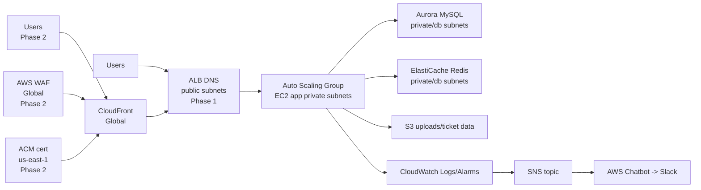
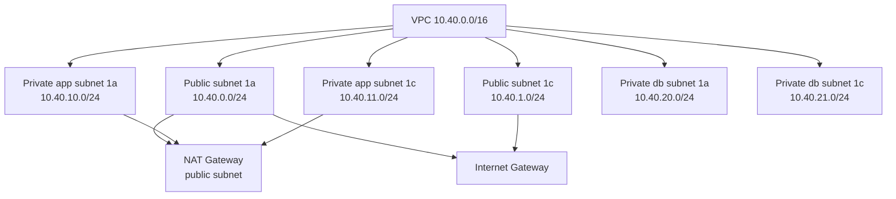
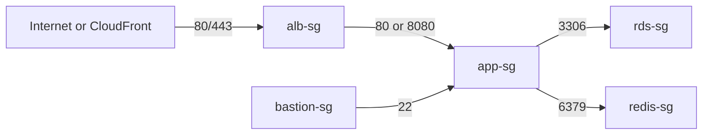

# AWS Console Setup Runbook

Hướng dẫn này đi theo architecture trong file thiết kế, nhưng chia làm 2 phase:

```text
Phase 1 - Chưa có domain, bỏ qua CloudFront:
Users -> ALB DNS HTTP -> Auto Scaling EC2 -> Aurora MySQL/Redis/S3

Phase 2 - Khi có domain:
Users -> CloudFront + WAF + HTTPS -> ALB -> Auto Scaling EC2 -> Aurora MySQL/Redis/S3
```

Region mặc định:

```text
Application region: ap-northeast-1
CloudFront/ACM global certificate region: us-east-1, chỉ cần ở Phase 2
```

## 0. Sơ đồ tổng quan



Thứ tự tạo:

```text
Phase 1:
VPC/Subnets/IGW/NAT/Route tables -> Security Groups
-> S3 -> Aurora -> Redis -> IAM Role
-> Launch Template -> Target Group -> ASG -> ALB HTTP
-> CloudWatch/SNS/Slack -> CloudTrail/Security Hub

Phase 2:
ACM -> WAF -> CloudFront -> DNS -> ALB HTTPS optional
```

## Phase 1 - Lab không domain, bỏ qua CloudFront

Mục tiêu Phase 1:

```text
Dùng ALB DNS tạm thời
Chạy HTTP port 80
Không tạo ACM, CloudFront, WAF, Route 53
Tập trung học VPC, subnet, NAT, SG, EC2 ASG, Aurora, Redis, S3, monitoring
```

Link test tạm thời sau khi xong Phase 1:

```text
http://<alb-dns-name>
http://<alb-dns-name>/health
```

## Phase 1.1 Tạo VPC



Thao tác:

1. Chuyển region sang `ap-northeast-1`.
2. Vào `VPC`.
3. Chọn `Your VPCs`.
4. Bấm `Create VPC`.
5. Chọn `VPC only`.
6. Điền:

```text
Name tag: eventech-prod-vpc
IPv4 CIDR: 10.40.0.0/16
IPv6 CIDR block: No IPv6 CIDR block
Tenancy: Default
```

7. Bấm `Create VPC`.
8. Vào VPC vừa tạo, bấm `Actions -> Edit VPC settings`.
9. Bật:

```text
Enable DNS resolution
Enable DNS hostnames
```

## Phase 1.2 Tạo subnets

Vào:

```text
VPC -> Subnets -> Create subnet
```

Chọn VPC:

```text
eventech-prod-vpc
```

Tạo các subnet:

```text
eventech-prod-public-1a
AZ: ap-northeast-1a
CIDR: 10.40.0.0/24

eventech-prod-public-1c
AZ: ap-northeast-1c
CIDR: 10.40.1.0/24

eventech-prod-private-app-1a
AZ: ap-northeast-1a
CIDR: 10.40.10.0/24

eventech-prod-private-app-1c
AZ: ap-northeast-1c
CIDR: 10.40.11.0/24

eventech-prod-private-db-1a
AZ: ap-northeast-1a
CIDR: 10.40.20.0/24

eventech-prod-private-db-1c
AZ: ap-northeast-1c
CIDR: 10.40.21.0/24
```

Sau khi tạo public subnet:

1. Chọn `eventech-prod-public-1a`.
2. `Actions -> Edit subnet settings`.
3. Bật `Enable auto-assign public IPv4 address`.
4. Làm tương tự cho `eventech-prod-public-1c`.

## Phase 1.3 Tạo Internet Gateway

Vào:

```text
VPC -> Internet gateways -> Create internet gateway
```

Điền:

```text
Name tag: eventech-prod-igw
```

Sau khi tạo:

1. Chọn IGW.
2. `Actions -> Attach to VPC`.
3. Chọn `eventech-prod-vpc`.

## Phase 1.4 Tạo NAT Gateway

Vào:

```text
VPC -> NAT gateways -> Create NAT gateway
```

Điền:

```text
Name: eventech-prod-nat-1a
Subnet: eventech-prod-public-1a
Connectivity type: Public
Elastic IP allocation ID: Allocate Elastic IP
```

Bấm `Create NAT gateway`.

Cho status thành:

```text
Available
```

## Phase 1.5 Tạo route tables

### Public route table

Vào:

```text
VPC -> Route tables -> Create route table
```

Điền:

```text
Name: eventech-prod-public-rt
VPC: eventech-prod-vpc
```

Them route:

```text
Destination: 0.0.0.0/0
Target: eventech-prod-igw
```

Associate subnets:

```text
eventech-prod-public-1a
eventech-prod-public-1c
```

### Private app route table

Tạo route table:

```text
Name: eventech-prod-private-app-rt
VPC: eventech-prod-vpc
```

Them route:

```text
Destination: 0.0.0.0/0
Target: eventech-prod-nat-1a
```

Associate:

```text
eventech-prod-private-app-1a
eventech-prod-private-app-1c
```

### Private DB route table

Tạo route table:

```text
Name: eventech-prod-private-db-rt
VPC: eventech-prod-vpc
```

Nếu DB/Redis không cần outbound internet, không cần route `0.0.0.0/0`.

Associate:

```text
eventech-prod-private-db-1a
eventech-prod-private-db-1c
```

## Phase 1.6 Tạo security groups



Vào:

```text
EC2 -> Security Groups -> Create security group
```

### ALB SG

```text
Name: eventech-prod-alb-sg
VPC: eventech-prod-vpc

Inbound:
HTTP 80 from 0.0.0.0/0
HTTPS 443 from 0.0.0.0/0

Outbound:
All traffic to 0.0.0.0/0
```

### App EC2 SG

```text
Name: eventech-prod-app-sg
VPC: eventech-prod-vpc

Inbound:
HTTP 80 from eventech-prod-alb-sg
Custom TCP 8080 from eventech-prod-alb-sg nếu app listen 8080
SSH 22 from eventech-prod-bastion-sg nếu dùng bastion

Outbound:
All traffic to 0.0.0.0/0
```

### Bastion SG

```text
Name: eventech-prod-bastion-sg
VPC: eventech-prod-vpc

Inbound:
SSH 22 from YOUR_PUBLIC_IP/32

Outbound:
All traffic to 0.0.0.0/0
```

### RDS SG

```text
Name: eventech-prod-rds-sg
VPC: eventech-prod-vpc

Inbound:
MySQL/Aurora 3306 from eventech-prod-app-sg
```

### Redis SG

```text
Name: eventech-prod-redis-sg
VPC: eventech-prod-vpc

Inbound:
Custom TCP 6379 from eventech-prod-app-sg
```

## Phase 1.7 Tạo S3 bucket

Vào:

```text
S3 -> Buckets -> Create bucket
```

Điền:

```text
Bucket name: eventech-prod-uploads-<random>
AWS Region: ap-northeast-1
Object Ownership: ACLs disabled
Block Public Access: Block all public access
Bucket Versioning: Enable
Default encryption: SSE-S3
```

Laravel env:

```env
FILESYSTEM_DISK=s3
AWS_BUCKET=eventech-prod-uploads-<random>
AWS_DEFAULT_REGION=ap-northeast-1
```

## Phase 1.8 Tạo Aurora MySQL

Vào:

```text
RDS -> Subnet groups -> Create DB subnet group
```

Điền:

```text
Name: eventech-prod-db-subnet-group
VPC: eventech-prod-vpc
Availability Zones: ap-northeast-1a, ap-northeast-1c
Subnets: eventech-prod-private-db-1a, eventech-prod-private-db-1c
```

Tạo database:

```text
RDS -> Databases -> Create database
```

Chọn:

```text
Choose a database creation method: Standard create
Engine: Amazon Aurora
Edition: Amazon Aurora MySQL-Compatible Edition
Template: Production
DB cluster identifier: eventech-prod-aurora
Master username: eventech
Credentials management: Self managed or Secrets Manager
Instance class: theo budget, vì du db.t4g.medium cho start
Availability: Create an Aurora Replica in different AZ nếu cần HA
VPC: eventech-prod-vpc
DB subnet group: eventech-prod-db-subnet-group
Public access: No
VPC security group: eventech-prod-rds-sg
Database port: 3306
Initial database name: eventech
Backup retention: 7 đâys tro len
Deletion protection: Enable
```

Kết quả cần lấy:

```text
Writer endpoint
DB name
Username
Password
```

## Phase 1.9 Tạo ElastiCache Redis

Vào:

```text
ElastiCache -> Subnet groups -> Create
```

Điền:

```text
Name: eventech-prod-redis-subnet-group
VPC: eventech-prod-vpc
Subnets: eventech-prod-private-db-1a, eventech-prod-private-db-1c
```

Tạo Redis:

```text
ElastiCache -> Redis OSS caches -> Create
```

Chọn:

```text
Deployment option: Design your own cache
Creation method: Cluster cache
Name: eventech-prod-redis
Location: AWS Cloud
Multi-AZ: Enable nếu production cần HA
Nođể type: cache.t4g.micro/t4g.small tuy budget
Subnet group: eventech-prod-redis-subnet-group
Security group: eventech-prod-redis-sg
Encryption at rest: Enable
Encryption in transit: Enable nếu app/client support TLS
```

Kết quả cần lấy:

```text
Primary endpoint
```

Laravel env:

```env
CACHE_STORE=redis
SESSION_DRIVER=redis
REDIS_HOST=<primary-endpoint>
```

## Phase 1.10 Tạo IAM role cho EC2 app

Vào:

```text
IAM -> Roles -> Create role
```

Chọn:

```text
Trusted entity type: AWS service
Use case: EC2
```

Attach managed policies:

```text
AmazonSSMManagedInstanceCore
CloudWatchAgentServerPolicy
```

Tạo inline policy cho S3/SQS/SSM:

```json
{
  "Version": "2012-10-17",
  "Statement": [
    {
      "Effect": "Allow",
      "Action": [
        "s3:GetObject",
        "s3:PutObject",
        "s3:DeleteObject",
        "s3:ListBucket"
      ],
      "Resource": [
        "arn:aws:s3:::eventech-prod-uploads-<random>",
        "arn:aws:s3:::eventech-prod-uploads-<random>/*"
      ]
    },
    {
      "Effect": "Allow",
      "Action": [
        "ssm:GetParameter",
        "ssm:GetParameters",
        "secretsmanager:GetSecretValue"
      ],
      "Resource": "*"
    }
  ]
}
```

Role name:

```text
eventech-prod-app-ec2-role
```

## Phase 1.11 Tạo Bastion EC2

Khuyến nghị dùng SSM Session Manager thay SSH. Nếu vẫn cần bastion:

Vào:

```text
EC2 -> Instances -> Launch instances
```

Điền:

```text
Name: eventech-prod-bastion
AMI: Amazon Linux 2023 or Ubuntu
Instance type: t3.micro
Key pair: chon key pair của team
Network: eventech-prod-vpc
Subnet: eventech-prod-public-1a
Auto-assign public IP: Enable
Security group: eventech-prod-bastion-sg
IAM role: AmazonSSMManagedInstanceCore role nếu có
```

## Phase 1.12 Tạo AMI app hoặc Launch Template

Nếu đã có AMI master Laravel:

```text
AMI ID: ami-xxxxxxxx
```

Nếu chưa có, tạo EC2 tạm, cài app/Nginx/PHP/Node/Supervisor/CloudWatch Agent/CodeDeploy Agent, test OK rồi:

```text
EC2 -> Instances -> chon instance
Actions -> Image and templates -> Create image
```

Tạo Launch Template:

```text
EC2 -> Launch Templates -> Create launch template
```

Điền:

```text
Name: eventech-prod-app-lt
AMI: app AMI ID
Instance type: t3.medium
Key pair: optional
Security groups: eventech-prod-app-sg
IAM instance profile: eventech-prod-app-ec2-role
```

Advanced details -> User data:

```bash
#!/bin/bash
set -e
systemctl restart nginx || true
systemctl restart php-fpm || true
cd /var/www/html || exit 0
php artisan config:cache || true
php artisan view:cache || true
php artisan queue:restart || true
```

## Phase 1.13 Tạo Target Group

Vào:

```text
EC2 -> Target Groups -> Create target group
```

Điền:

```text
Target type: Instances
Name: eventech-prod-app-tg
Protocol: HTTP
Port: 80
VPC: eventech-prod-vpc
Protocol version: HTTP1
Health check protocol: HTTP
Health check path: /health
Success codes: 200
```

Không cần register target thủ công nếu Auto Scaling Group se attach target group.

## Phase 1.14 Tạo Auto Scaling Group

Vào:

```text
EC2 -> Auto Scaling Groups -> Create Auto Scaling group
```

Điền:

```text
Name: eventech-prod-app-asg
Launch template: eventech-prod-app-lt
VPC: eventech-prod-vpc
Subnets: eventech-prod-private-app-1a, eventech-prod-private-app-1c
```

Load balancing:

```text
Attach to an existing load balancer
Choose from your load balancer target groups
Target group: eventech-prod-app-tg
Health checks: Turn on Elastic Load Balancing health checks
Health check grace period: 300 seconds
```

Group size:

```text
Desired capacity: 2
Minimum capacity: 2
Maximum capacity: 6
```

Scaling policy:

```text
Target tracking scaling policy
Metric type: Average CPU utilization
Target value: 60
```

## Phase 1.15 Tạo ALB HTTP

Vào:

```text
EC2 -> Load Balancers -> Create load balancer -> Application Load Balancer
```

Điền:

```text
Name: eventech-prod-alb
Scheme: Internet-facing
IP address type: IPv4
VPC: eventech-prod-vpc
Mappings: eventech-prod-public-1a, eventech-prod-public-1c
Security group: eventech-prod-alb-sg
```

Listeners:

```text
Phase 1, chưa có domain:
HTTP 80 -> Forward to eventech-prod-app-tg

Phase 2, khi có domain/certificate:
HTTP 80 -> Redirect to HTTPS 443
HTTPS 443 -> Forward to eventech-prod-app-tg
Certificate: ACM ap-northeast-1 certificate
```

Nếu chưa có cert/domain, tạm dùng:

```text
HTTP 80 -> Forward to eventech-prod-app-tg
```

## Phase 1.16 Kiểm tra ALB

Vào:

```text
EC2 -> Target Groups -> eventech-prod-app-tg -> Targets
```

Cho target thành:

```text
Healthy
```

Test ALB DNS:

```bash
curl -i http://<alb-dns-name>/health
```

Mở app tạm thời bằng ALB DNS:

```text
http://<alb-dns-name>
```

Ví dụ ALB DNS có dạng:

```text
eventech-prod-alb-123456789.ap-northeast-1.elb.amazonaws.com
```

Thì link tạm thời:

```text
http://eventech-prod-alb-123456789.ap-northeast-1.elb.amazonaws.com
```

Nếu fail:

```text
Kiểm tra app listen port nào
Kiểm tra app-sg inbound from alb-sg
Kiểm tra health path /health
Kiểm tra instance log Nginx/PHP
```

## Phase 1.17 Tạo SSM/Secrets cho app config

Vào:

```text
Systems Manager -> Parameter Store -> Create parameter
```

Tạo các key:

```text
/eventech/production/APP_KEY
/eventech/production/APP_URL
/eventech/production/DB_HOST
/eventech/production/DB_DATABASE
/eventech/production/DB_USERNAME
/eventech/production/DB_PASSWORD
/eventech/production/REDIS_HOST
/eventech/production/AWS_BUCKET
/eventech/production/AWS_DEFAULT_REGION
```

Loại:

```text
String: APP_URL, DB_HOST, DB_DATABASE, DB_USERNAME, REDIS_HOST, AWS_BUCKET, AWS_DEFAULT_REGION
SecureString: APP_KEY, DB_PASSWORD
```

## Phase 1.18 Tạo CloudWatch alarms

Vào:

```text
CloudWatch -> Alarms -> Create alarm
```

Tạo các alarm:

```text
ALB HTTPCode_ELB_5XX_Count > 10 trong 5 phút
ALB UnHealthyHostCount >= 1
ASG/EC2 CPUUtilization > 70%
RDS CPUUtilization > 70%
RDS FreeStorageSpace thấp
RDS DatabaseConnections cao
ElastiCache CPUUtilization > 70%
ElastiCache FreeableMemory thấp
```

Alarm action:

```text
SNS topic: eventech-prod-alerts
```

## Phase 1.19 Tạo SNS + Slack

Tạo SNS topic:

```text
SNS -> Topics -> Create topic
Type: Standard
Name: eventech-prod-alerts
```

Kết nối Slack:

```text
AWS Chatbot -> Configure chat client -> Slack
```

Sau khi authorize Slack:

```text
Configure new channel
Configuration name: eventech-prod-alerts
Slack channel: #aws-alerts
IAM role: tạo role mới hoặc chọn role chatbot có sẵn
SNS topics: eventech-prod-alerts
```

Test:

```text
SNS -> topic -> Publish message
```

Kiểm tra message vào Slack.

## Phase 1.20 Bật CloudTrail

Vào:

```text
CloudTrail -> Trails -> Create trail
```

Điền:

```text
Trail name: eventech-prod-trail
Apply trail to all regions: Yes
Management events: Read and Write
Storage location: Create new S3 bucket
Log file validation: Enabled
```

## Phase 1.21 Bật Security Hub

Vào:

```text
Security Hub -> Go to Security Hub -> Enable
```

Bật standards:

```text
AWS Foundational Security Best Practices
CIS AWS Foundations Benchmark
```

## Phase 1.22 Deploy app lần đầu

Nếu đang dùng AMI:

1. Build AMI mới từ master app server.
2. Vào `EC2 -> Launch Templates`.
3. Chọn `eventech-prod-app-lt`.
4. `Actions -> Modify template`.
5. Tạo version mới với AMI ID mới.
6. Vào `Auto Scaling Groups -> eventech-prod-app-asg`.
7. `Instance refresh -> Start instance refresh`.
8. Chọn:

```text
Minimum healthy percentage: 100
Instance warmup: 300 seconds
```

Theo dõi:

```text
ASG Activity
Target Group health
ALB 5xx metrics
```

Nếu dùng CodeDeploy/GitHub Actions sau này, AMI chỉ nên là base image, code release không cần build AMI mới mỗi lần.

## Phase 2 - Thêm domain, HTTPS, CloudFront và WAF

Chỉ làm Phase 2 sau khi bạn đã có domain và Phase 1 đã chạy OK bằng ALB DNS.

Mục tiêu Phase 2:

```text
Tạo ACM certificate cho domain
Thêm HTTPS
Tạo WAF
Tạo CloudFront distribution
Trỏ DNS vào CloudFront
```

Kết quả mong đợi:

```text
https://app.example.com
https://app.example.com/health
```

## Phase 2.1 Tạo ACM certificate cho CloudFront

CloudFront cần certificate trong `us-east-1`.

Thao tác:

1. Vào AWS Console.
2. Chuyển region sang `us-east-1`.
3. Vào `Certificate Manager`.
4. Bấm `Request certificate`.
5. Chọn `Request a public certificate`.
6. Nhập domain:

```text
app.example.com
```

7. Validation method: `DNS validation`.
8. Bấm `Request`.
9. Nếu DNS nằm trên Route 53, bấm `Create records in Route 53`.
10. Cho status thành `Issued`.

Kết quả cần lấy:

```text
ACM certificate ARN in us-east-1
```

## Phase 2.2 Tạo ACM certificate cho ALB - optional

Nếu CloudFront -> ALB dùng HTTPS, tạo cert trong `ap-northeast-1`.

Thao tác:

1. Chuyển region sang `ap-northeast-1`.
2. Vào `Certificate Manager`.
3. `Request certificate`.
4. Domain có thể là:

```text
app.example.com
```

hoặc origin riêng:

```text
alb-origin.example.com
```

5. Validate DNS.
6. Cho status `Issued`.

Kết quả cần lấy:

```text
ACM certificate ARN in ap-northeast-1
```

## Phase 2.3 Tạo WAF

Khi vào Phase 2, tạo WAF để attach vào CloudFront.

Vào:

```text
WAF & Shield -> Web ACLs -> Create web ACL
```

Điền:

```text
Name: eventech-prod-waf
Resource type: CloudFront distributions
Region: Global / CloudFront
```

Add managed rules:

```text
AWSManagedRulesCommonRuleSet
AWSManagedRulesKnownBadInputsRuleSet
AWSManagedRulesSQLiRuleSet
```

Thêm rate limit rule:

```text
Rule type: Rate-based rule
Limit: 2000 requests / 5 minutes / IP
Action: Block
```

Ban đầu có thể set action `Count` để quan sát trước, sau đó đổi sang `Block`.

## Phase 2.4 Tạo CloudFront distribution

Phase 1 user truy cập trực tiếp qua ALB DNS. Phase 2 sẽ đưa user qua CloudFront.

Vào:

```text
CloudFront -> Distributions -> Create distribution
```

Origin:

```text
Origin domain: eventech-prod-alb DNS name
Protocol: HTTPS only nếu ALB có HTTPS
HTTP port: 80
HTTPS port: 443
```

Default cache behavior:

```text
Viewer protocol policy: Redirect HTTP to HTTPS
Allowed HTTP methods: GET, HEAD, OPTIONS, PUT, POST, PATCH, DELETE
Cache policy: CachingDisabled cho app dynamic
Origin request policy: AllViewerExceptHostHeader hoặc custom policy cần thiết
Compress objects automatically: Yes
```

Settings:

```text
Alternate domain name: app.example.com
Custom SSL certificate: ACM us-east-1 certificate
Web ACL: eventech-prod-waf
HTTP versions: HTTP/2 and HTTP/3
```

Sau khi tạo, cho status:

```text
Deployed
```

## Phase 2.5 Tạo behavior riêng cho static assets

Trong CloudFront distribution:

```text
Behaviors -> Create behavior
```

Điền:

```text
Path pattern: /build/*
Origin: ALB
Viewer protocol policy: Redirect HTTP to HTTPS
Allowed methods: GET, HEAD, OPTIONS
Cache policy: CachingOptimized
Compress objects automatically: Yes
```

Nếu static assets đưa thẳng lên S3/CDN riêng thì origin có thể là S3.

## Phase 2.6 Trỏ DNS

Khi có domain, trỏ DNS vào CloudFront. Nếu muốn đơn giản hơn trong Phase 2, cũng có thể trỏ DNS vào ALB trước, sau đó chuyển sang CloudFront sau.

Nếu dùng Route 53:

```text
Route 53 -> Hosted zones -> your domain -> Create record
```

Điền:

```text
Record name: app
Record type: A
Alias: Yes
Route traffic to: Alias to CloudFront distribution
```

Nếu DNS nằm ngoài AWS, tạo CNAME:

```text
app.example.com -> <cloudfront-domain>.cloudfront.net
```

## Kiểm tra end-to-end theo phase

```text
[ ] Phase 1: http://<alb-dns-name>/health trả 200
[ ] Phase 2: CloudFront distribution Deployed
[ ] Phase 2: DNS app.example.com trỏ về CloudFront
[ ] Phase 2: https://app.example.com/health trả 200
[ ] Target Group all healthy
[ ] EC2 app nằm trong private subnet, không public IP
[ ] EC2 app ra internet được qua NAT
[ ] App connect Aurora OK
[ ] App connect Redis OK
[ ] Upload S3 OK
[ ] CloudWatch có logs
[ ] Alarm gửi Slack OK
[ ] CloudTrail enabled
[ ] Security Hub enabled
```

## Troubleshooting

Target group unhealthy:

```text
Sai port app/target group
Security group app không allow from ALB SG
/health bị redirect hoặc trả non-200
App chưa start xong, tăng health check grace period
```

CloudFront 502:

```text
Chỉ áp dụng Phase 2.
CloudFront origin protocol HTTPS nhưng ALB chưa có cert hợp lệ
ALB security group không cho traffic từ CloudFront
Target group unhealthy
```

EC2 private không update/pull code được:

```text
Private route table chưa trỏ 0.0.0.0/0 qua NAT Gateway
NAT Gateway chưa Available
Public subnet của NAT chưa route ra Internet Gateway
```

App không connect DB:

```text
RDS public access phải No
RDS SG allow 3306 from app SG
DB endpoint/username/password đúng
DB subnet group nằm trong private/db subnets
```

Session bị mất khi scale:

```text
Không dùng file session trên EC2 local
Dùng Redis hoặc database session
SESSION_DRIVER=redis
```

Upload mất sau deploy:

```text
Không lưu upload vào local disk của EC2
Dùng S3
FILESYSTEM_DISK=s3
```

## Dọn dẹp resource để tránh phát sinh phí

Nếu chỉ dùng để học thao tác, nên tắt/xoá resource ngay sau khi test xong. Các resource dễ tốn phí nhất trong setup này:

```text
NAT Gateway
Aurora/RDS
ElastiCache Redis
EC2 instances trong Auto Scaling Group
Application Load Balancer
Elastic IP nếu không gắn với resource đang chạy
S3 storage nếu upload nhiều file
CloudWatch Logs nếu log lớn
CloudTrail S3 logs nếu để lâu
```

### Cách tạm dừng ngắn hạn, vẫn giữ cấu hình

Dùng cách này nếu ngày mai muốn bật lại nhanh.

1. Scale Auto Scaling Group về 0:

```text
EC2 -> Auto Scaling Groups -> eventech-prod-app-asg
Edit
Desired capacity: 0
Minimum capacity: 0
Maximum capacity: 0 hoặc giữ 6 nếu muốn bật lại nhanh
Update
```

2. Stop Bastion EC2 nếu có:

```text
EC2 -> Instances -> eventech-prod-bastion
Instance state -> Stop instance
```

3. Stop RDS/Aurora nếu AWS Console cho phép:

```text
RDS -> Databases -> eventech-prod-aurora
Actions -> Stop
```

Lưu ý:

```text
RDS stop tối đa 7 ngày, sau đó AWS có thể tự start lại.
Nếu muốn không tốn phí DB lâu dài, cần snapshot rồi delete.
```

4. Redis/ElastiCache không có stop như EC2:

```text
Muốn hết phí Redis thì phải delete cache.
Nếu cần giữ data, snapshot trước khi delete.
```

5. NAT Gateway không có stop:

```text
Muốn hết phí NAT Gateway thì phải delete NAT Gateway và release Elastic IP.
```

### Cách xoá sạch lab sau khi học xong

Dùng thứ tự này để tránh lỗi dependency.

1. Xoá CloudFront/WAF/ACM nếu đã tạo Phase 2:

```text
CloudFront -> Distribution -> Disable -> wait Deployed -> Delete
WAF -> Web ACL -> Delete
ACM -> Certificates -> Delete nếu không dùng nữa
Route 53 record -> Delete nếu đã tạo
```

2. Scale và xoá Auto Scaling Group:

```text
EC2 -> Auto Scaling Groups -> eventech-prod-app-asg
Edit capacity: desired 0, min 0
Chờ instances terminate
Actions -> Delete
```

3. Xoá Launch Template nếu không cần:

```text
EC2 -> Launch Templates -> eventech-prod-app-lt
Actions -> Delete template
```

4. Xoá ALB:

```text
EC2 -> Load Balancers -> eventech-prod-alb
Actions -> Delete load balancer
```

5. Xoá Target Group:

```text
EC2 -> Target Groups -> eventech-prod-app-tg
Actions -> Delete
```

6. Terminate Bastion EC2 nếu có:

```text
EC2 -> Instances -> eventech-prod-bastion
Instance state -> Terminate instance
```

7. Xoá Redis:

```text
ElastiCache -> Redis OSS caches -> eventech-prod-redis
Actions -> Delete
Chọn tạo final snapshot nếu cần giữ data
```

8. Xoá Aurora/RDS:

```text
RDS -> Databases -> eventech-prod-aurora
Actions -> Delete
```

Nếu đang bật deletion protection:

```text
Modify -> Disable deletion protection -> Apply immediately
Sau đó mới Delete
```

Nên chọn:

```text
Create final snapshot: Yes nếu cần giữ data
Create final snapshot: No nếu chỉ là lab và muốn xoá nhanh
```

9. Làm rỗng và xoá S3 bucket:

```text
S3 -> eventech-prod-uploads-<random>
Empty bucket
Delete bucket
```

Nếu bucket bật versioning, cần xoá cả object versions và delete markers. Trong Console:

```text
S3 bucket -> Objects -> Show versions -> Empty
```

10. Xoá NAT Gateway và release Elastic IP:

```text
VPC -> NAT gateways -> eventech-prod-nat-1a
Actions -> Delete NAT gateway
Cho status Deleted

EC2 -> Elastic IPs
Chọn EIP của NAT
Actions -> Release Elastic IP address
```

Đây là bước quan trọng vì NAT Gateway và Elastic IP để quên có thể tiếp tục tính phí.

11. Xoá route tables/subnets/VPC:

```text
VPC -> Route tables -> delete custom route tables
VPC -> Subnets -> delete public/private/db subnets
VPC -> Internet gateways -> detach from VPC -> delete
VPC -> Your VPCs -> eventech-prod-vpc -> delete
```

Nếu delete VPC fail, thường là còn resource đang nằm trong VPC:

```text
ENI của ALB/NAT/RDS/Redis
Security group đang bị reference
Subnet còn resource
VPC endpoint nếu đã tạo
```

12. Xoá Security Groups:

```text
EC2 -> Security Groups
Delete eventech-prod-alb-sg
Delete eventech-prod-app-sg
Delete eventech-prod-bastion-sg
Delete eventech-prod-rds-sg
Delete eventech-prod-redis-sg
```

Nếu security group bị dependency, xoá resource đang dùng nó trước.

13. Xoá IAM roles/policies nếu chỉ dùng cho lab:

```text
IAM -> Roles -> eventech-prod-app-ec2-role
Detach policies
Delete inline policies
Delete role
```

14. Xoá SSM parameters/secrets:

```text
Systems Manager -> Parameter Store
Delete /eventech/production/*

Secrets Manager
Delete secrets nếu đã tạo DB/app secrets
```

15. Xoá CloudWatch logs và alarms:

```text
CloudWatch -> Alarms -> delete eventech-prod alarms
CloudWatch -> Log groups -> delete /aws/ec2/... hoặc /eventech/... lab logs
```

16. Xoá SNS topic và AWS Chatbot config:

```text
SNS -> Topics -> eventech-prod-alerts -> Delete
AWS Chatbot -> Configured clients/channels -> delete config nếu không dùng
```

17. Xoá CloudTrail lab nếu không cần:

```text
CloudTrail -> Trails -> eventech-prod-trail -> Stop logging -> Delete
S3 bucket lưu CloudTrail logs -> Empty -> Delete nếu chỉ là lab
```

18. Kiểm tra lại Billing:

```text
Billing and Cost Management -> Cost Explorer
Billing and Cost Management -> Bills
```

Nên kiểm tra các service còn phí:

```text
EC2-Other
NAT Gateway
Elastic Load Balancing
RDS
ElastiCache
S3
CloudWatch
Data Transfer
```

### Checklist tắt phí nhanh

```text
[ ] ASG desired/min = 0 hoặc đã delete ASG
[ ] Không còn EC2 running
[ ] ALB đã delete
[ ] Target Group đã delete
[ ] NAT Gateway đã delete
[ ] Elastic IP đã release
[ ] RDS/Aurora đã stop hoặc delete
[ ] Redis đã delete
[ ] S3 bucket đã empty/delete nếu không cần
[ ] CloudWatch alarms/log groups lab đã delete nếu không cần
[ ] CloudFront/WAF đã delete nếu có tạo
[ ] Cost Explorer không còn service bất thường sau vài giờ
```
